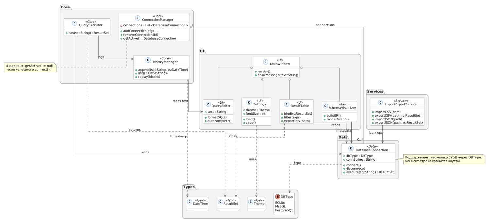
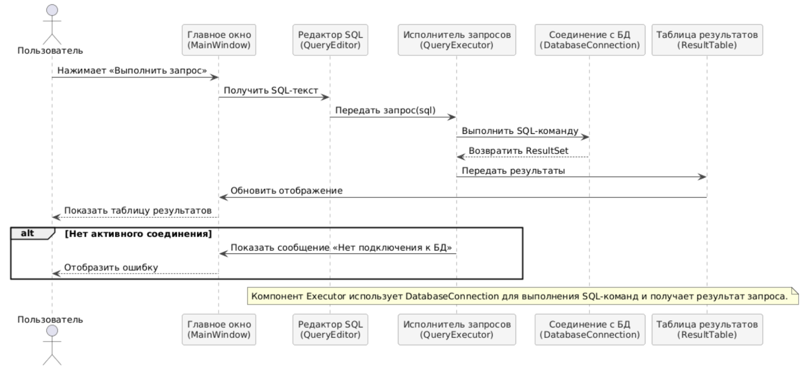

# SQL Editor

Это простое графическое приложение для работы с реляционными базами данных SQLite.  
Позволяет подключать локальные `.db`-файлы, выполнять запросы `SELECT` и просматривать результаты в табличной форме.  
Проект реализован на Python с использованием **PyQt6**.

---

## Функциональность

- Подключение к существующей базе данных SQLite (`.db`, `.sqlite`, `.sqlite3`)
- Автоматическое отображение списка таблиц в боковой панели
- Редактор SQL-запросов с ручным вводом команд
- Выполнение запросов `SELECT` и отображение результатов в таблице
- Разделение интерфейса на вкладки:  
  **Данные**, **Структура**, **История**
- Адаптивный интерфейс и тёмная тема

---

## Структура проекта

```text
sql_editor/
├─ __init__.py
├─ main.py              # Точка входа
├─ app.py               # Инициализация QApplication
├─ db/
│  ├─ __init__.py
│  └─ connection.py     # Класс Database (подключение и SELECT)
└─ ui/
   ├─ __init__.py
   └─ main_window.py    # Главное окно, интерфейс и логика
```

---

## Установка и запуск

### Требования
- Python 3.10+
- PyQt6

### Установка зависимостей
```bash
pip install -r requirements.txt
```

### Запуск
Из корня проекта:
```bash
python sql_editor/main
```

---

## Использование

1. Нажмите «Подключить БД» и выберите файл `.db`
2. Введите SQL-запрос, например:
   ```sql
   SELECT * FROM users;
   ```
3. Нажмите «Run» — результат появится в таблице
4. Список таблиц базы отображается в левой панели

---

## Технологии

| Компонент | Используется |
|------------|--------------|
| Язык | Python 3 |
| GUI | PyQt6 |
| База данных | SQLite |
| IDE | PyCharm |

---

## Описание модулей

| Модуль | Назначение |
|--------|-------------|
| `sql_editor/main.py` | Точка входа в программу. Запускает функцию `run()` из `app.py`. |
| `sql_editor/app.py` | Инициализирует `QApplication` и открывает главное окно приложения. |
| `sql_editor/db/connection.py` | Класс `Database`: подключение к SQLite и выполнение SQL-запросов. |
| `sql_editor/ui/main_window.py` | Класс `MainWindow`: реализует интерфейс, обработку кнопок, отображение таблиц и статуса. |
| `README.md` | Документация проекта. |
| `requirements.txt` | Зависимости проекта (PyQt6). |

---

## UML-диаграммы
Ниже приведены UML-диаграммы, описывающие структуру и логику приложения SQL Editor.

### Диаграмма классов

*Отражает архитектуру приложения, связи между классами `MainWindow` и `Database`.*

### Диаграмма последовательности

*Показывает взаимодействие пользователя с интерфейсом и обработку SQL-запросов.*

---
